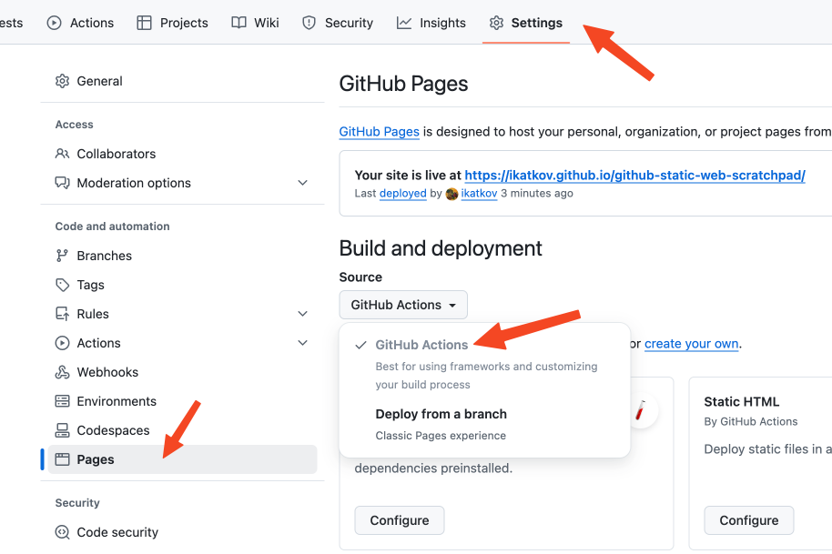
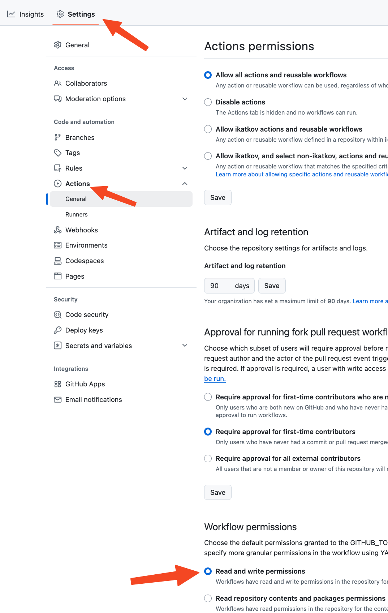

# Scratchpad for all static pages that needs https static hosting

Live https://ikatkov.github.io/github-static-web-scratchpad/%page-name%

# Configuration

In GitHub repo settings:

## Enable pages

The source should be "GitHub actions", not "Deploy from a brunch"

## Allows actions to commit back to the code

